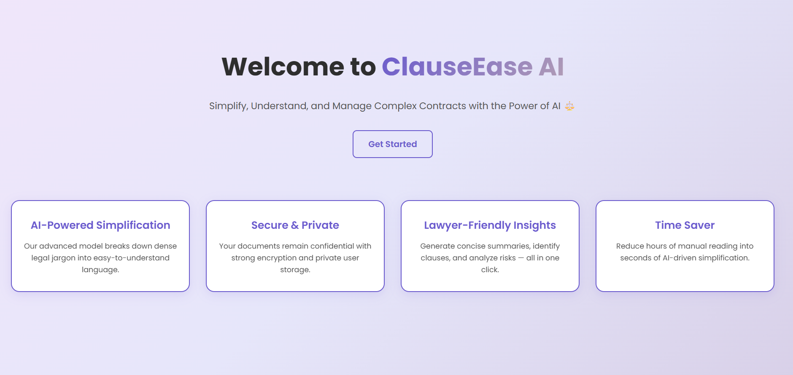
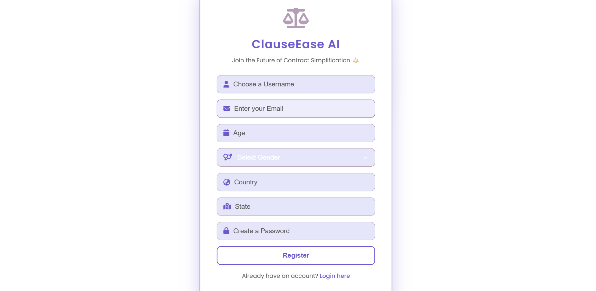
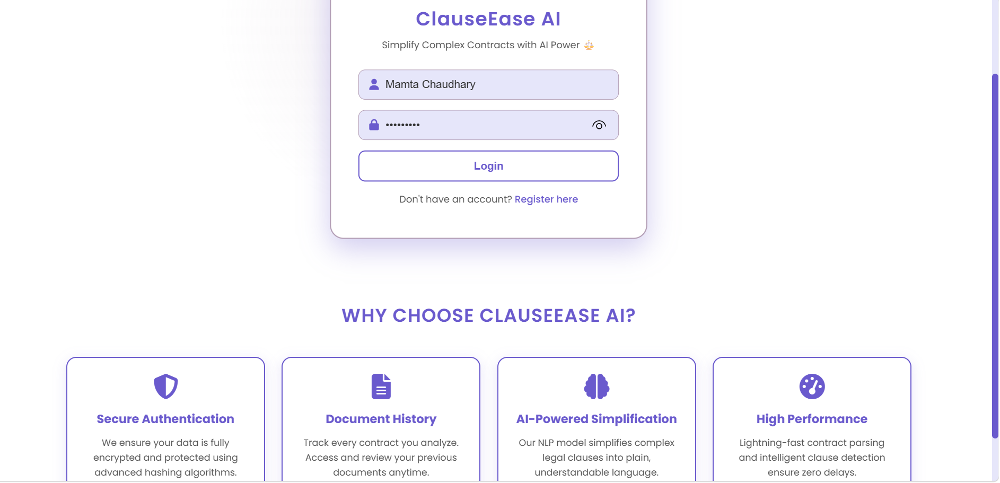
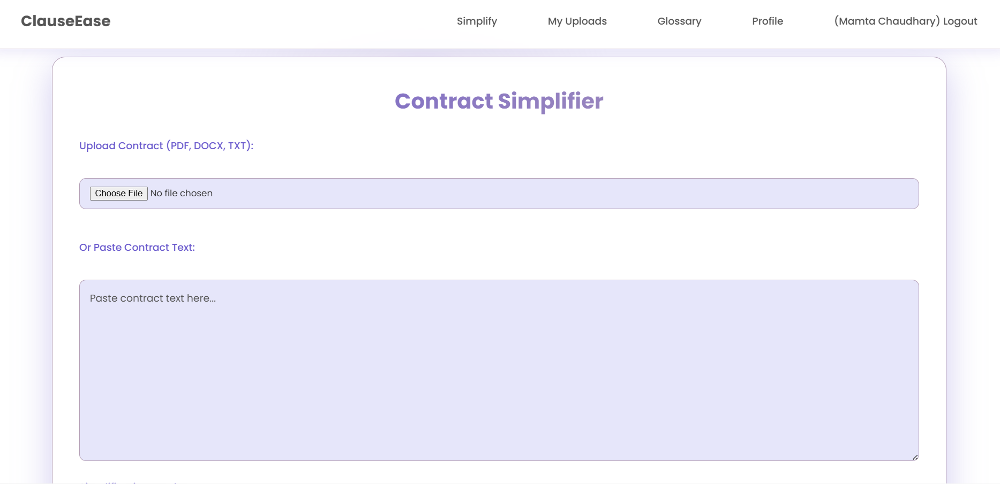
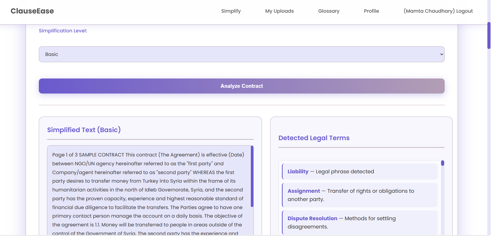
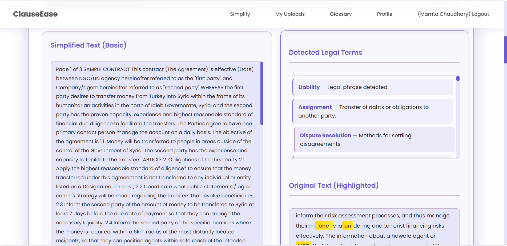
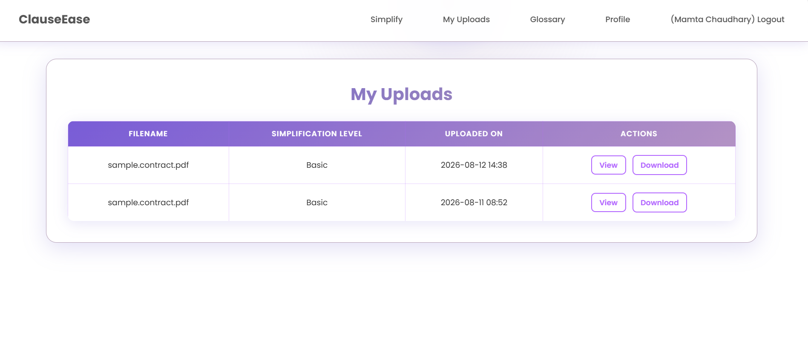
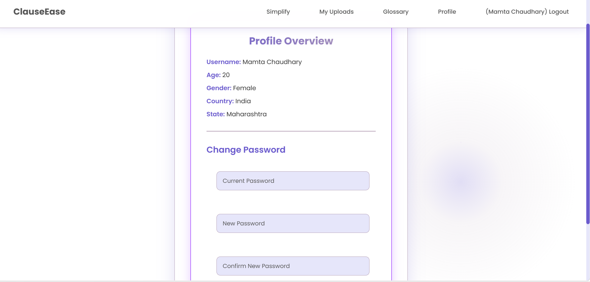
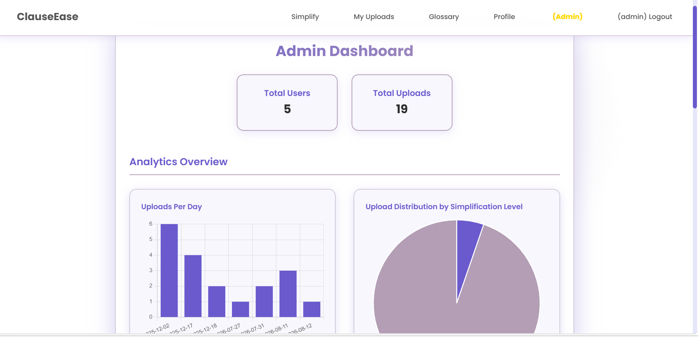
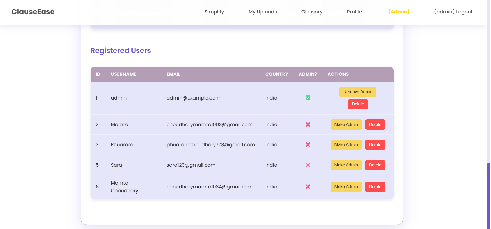

# ⚖️ ClauseEase AI

### AI-Based Contract Language Simplifier

> **Simplify. Understand. Manage Complex Contracts with the Power of AI.**

ClauseEase AI is a web-based AI application that helps users understand complex legal and contractual documents by simplifying legal language and identifying important legal terms.
---

## 📌 Project Overview

ClauseEase AI provides an end-to-end platform for analyzing and simplifying legal and contractual documents.

Users can register, securely log in, upload a contract or paste contract text, select a simplification level, and analyze the document.

The application generates simplified contract text and identifies important legal terminology to make complex documents easier to understand.

The system also includes a dedicated administrative dashboard where authorized administrators can manage users, maintain the legal glossary, and view application-level analytics such as registered users, uploaded contracts, and simplification statistics.
---

## 🎯 Project Objectives

- Simplify complex contractual language
- Help non-legal users understand legal documents
- Detect important legal terminology
- Provide different levels of text simplification
- Allow users to access their previously analyzed contracts
- Provide a searchable legal glossary
- Provide administrators with application-level analytics
- Provide administrators with user and glossary management
---

## ✨ Main Features

### 👤 User Registration & Login

The application provides a complete authentication system.

Users can:

- Create an account
- Enter their personal information
- Create a password
- Log in and log out
- Manage their profile
- Change their password

### 📄 Contract Simplification

Users can provide contract content in two ways:

**Upload a document:**

- PDF
- DOCX
- TXT

**OR**

Paste contract text directly into the application.

### 🤖 AI-Based Contract Analysis

Users can select a simplification level and analyze the provided contract.

The application processes the contract and generates simplified content.

### ⚖️ Legal Term Detection

ClauseEase AI identifies important legal terminology from the contract and displays the detected terms separately from the simplified text.

Examples include:

- Liability
- Assignment
- Dispute Resolution
- Governing Law

### 📊 Simplification Levels

The application provides multiple levels of text simplification:

- Basic
- Intermediate
- Advanced

### 📁 My Uploads

Users can access their previously processed contracts through the **My Uploads** section.

### 📚 Legal Glossary

ClauseEase AI provides a dedicated glossary for understanding legal terminology.

The glossary is maintained by administrators.

### 👤 User Profile

Users can view their registered information and manage their account through the profile section.

The profile also provides a password-change facility.
---

## 👨‍💼 Admin Dashboard

ClauseEase AI includes a dedicated administrative dashboard that is accessible only to authorized administrators.

### 📈 Admin Analytics

Administrators can view application-level statistics such as:

- Total number of registered users
- Total number of uploaded contracts
- Uploads per day
- Upload distribution by simplification level
- Recent uploads

These statistics are available to administrators and are not part of the normal user interface.

### 👥 User Management

Administrators can view registered users and information such as:

- User ID
- Username
- Email
- Country
- Admin status

Administrators can also:

- Promote a user to administrator
- Remove administrator privileges
- Delete user accounts

### 📖 Glossary Management

Administrators can manage the legal glossary by:

- Adding legal terms
- Editing existing terms
- Deleting terms
- Maintaining their meanings
---

## 🔄 Project Workflow
--- 

```text
                         ClauseEase AI
                              │
                              ▼
                       Welcome Page
                              │
                              ▼
                         Registration
                              │
                              ▼
                            Login
                              │
                              ▼
                    Contract Simplifier
                       /            \
                      /              \
             Upload Document       Paste Text
              PDF/DOCX/TXT
                      \              /
                       \            /
                        ▼          ▼
                 Select Simplification
                         Level
                           │
                           ▼
                    Analyze Contract
                           │
                  ┌────────┴────────┐
                  ▼                 ▼
           Simplified Text    Legal Term Detection
                  │                 │
                  └────────┬────────┘
                           ▼
                     View Results
                           │
              ┌────────────┼────────────┐
              ▼            ▼            ▼
         My Uploads     Glossary      Profile
                                       
                           │
                           ▼
                   Admin Dashboard
                           │
             ┌─────────────┼─────────────┐
             ▼             ▼             ▼
         Analytics      Users        Glossary
```
---
# Application Screenshots
---

## 🖥️ Application Screenshots

### 🏠 Welcome Page



### 🔐 Login



### 📝 Registration



### 📄 Contract Simplifier



### 🤖 AI Simplification Result



### 📊 Additional Result



### 📤 Upload Contract



### 👤 User Profile



### 👨‍💼 Admin Dashboard



### 👥 User Management



## 🛠️ Technology Stack

### Frontend
- HTML5
- CSS3
- JavaScript

### Backend
- Python
- Flask

### Database
- SQLite
- Flask-SQLAlchemy

### Artificial Intelligence & NLP
- Hugging Face Transformers
- Legal-BERT
- Pegasus Paraphrase Model
- spaCy
- PhraseMatcher

### Document Processing
- PyMuPDF
- PyPDF2
- python-docx

### Security
- Werkzeug
- Password Hashing

### Deployment & Development
- Docker
- Docker Compose
- Git & GitHub
- Visual Studio Code

---
## ⭐ Key Features
---
### 👤 User Features

- **User Registration & Login**
  - Users can create an account and securely log in to the application.

- **Contract Upload**
  - Users can upload legal documents in PDF, DOCX, and TXT formats.

- **Text Input**
  - Users can also paste contract text directly into the application.

- **Multiple Simplification Levels**
  - Users can select the required level of simplification:
    - Basic
    - Intermediate
    - Advanced

- **AI-Based Contract Simplification**
  - The application simplifies complex contractual language into easier-to-understand text.

- **Legal Term Detection**
  - Important legal terminology is identified from the uploaded or entered contract.

- **Simplification Results**
  - Users can view the simplified contract and detected legal terms.

- **My Uploads**
  - Users can access their previously uploaded and processed documents.

- **Glossary**
  - Users can view legal terms and their simplified meanings.

- **User Profile**
  - Users can view and manage their profile information.


### 👨‍💼 Admin Features

> **Admin-only features:** The following features are available only to authorized administrators.

- **Admin Dashboard**
  - Administrators can access a dedicated dashboard for managing the application.

- **User Analytics**
  - Administrators can view the total number of registered users.

- **Upload Analytics**
  - Administrators can view information about uploaded documents and application usage.

- **User Management**
  - Administrators can view registered users and manage user accounts.

- **Glossary Management**
  - Administrators can add, edit, and delete legal terms and their meanings.

- **Application Statistics**
  - Administrators can view usage statistics and simplification-level information.


### 🤖 AI & NLP Features

- Legal clause identification using **Legal-BERT**.
- Legal terminology recognition using **spaCy** and **PhraseMatcher**.
- AI-based text simplification using **Transformer-based models**.
- Paraphrasing of complex contractual language.
- Detection and presentation of important legal terms.


### 📄 Document Processing

- PDF text extraction.
- DOCX text extraction.
- TXT text processing.
- Contract text preprocessing.
- Clause segmentation and analysis.
- Storage of processed documents and results.

---
## 📁 Project Structure
---

```text
ClauseEase-AI/
│
├── app.py
├── requirements.txt
├── Dockerfile
├── docker-compose.yml
├── .gitignore
├── README.md
│
├── templates/
│   ├── base.html
│   ├── home.html
│   ├── register.html
│   ├── login.html
│   ├── profile.html
│   ├── upload.html
│   ├── simplify.html
│   ├── glossary.html
│   ├── admin.html
│   ├── admin_glossary.html
│   ├── admin_glossary_add.html
│   └── admin_glossary_edit.html
│
├── static/
│   └── [CSS, JavaScript and other static assets]
│
└── screenshots/
    ├── home.png
    ├── register.png
    ├── login.png
    ├── upload.png
    ├── simplify.png
    ├── result.png
    ├── result2.png
    ├── profile.png
    ├── admin.png
    └── users.png
```
---
## 🚀 Installation & Setup
---

### 1. Clone the Repository

```bash
git clone https://github.com/Mamta31-coder/ClauseEase-AI.git
```

### 2. Navigate to the Project Directory

```bash
cd ClauseEase-AI
```

### 3. Create a Virtual Environment

```bash
python -m venv venv
```

### 4. Activate the Virtual Environment

**Windows:**

```bash
venv\Scripts\activate
```

**macOS / Linux:**

```bash
source venv/bin/activate
```

### 5. Install Dependencies

```bash
pip install -r requirements.txt
```

### 6. Run the Application

```bash
python app.py
```

### 7. Open the Application

After the application starts successfully, open:

```text
http://127.0.0.1:5000
```

---

## 🐳 Docker Setup

### Build and Start

```bash
docker-compose up --build
```

### Stop the Application

```bash
docker-compose down
```

---
## 🧠 Skills Demonstrated
--- 

### 💻 Programming & Web Development
- Python
- Flask
- HTML5
- CSS3
- JavaScript

### 🤖 Artificial Intelligence & NLP
- Natural Language Processing (NLP)
- Transformer-based Models
- Legal Document Analysis
- Text Simplification
- Legal Term Detection
- Named Entity Recognition (NER)
- Clause Classification

### 📚 Machine Learning & NLP Libraries
- Hugging Face Transformers
- PyTorch
- spaCy
- PhraseMatcher

### 📄 Document Processing
- PDF Text Extraction
- DOCX Text Extraction
- TXT File Processing
- Document Preprocessing

### 🗄️ Database & Backend
- Flask-SQLAlchemy
- SQLite
- User Authentication
- Role-Based Access Control
- CRUD Operations

### 🔐 Security
- Password Hashing
- User Authentication
- Admin Authentication
- Secure Session Management

### 🐳 Deployment & Development Tools
- Git & GitHub
- Docker
- Docker Compose
- Visual Studio Code

### 📊 Application & Dashboard Development
- Admin Dashboard Development
- Application Analytics
- Upload Management
- Glossary Management
- User Management

---
## 📈 Project Outcome
---

ClauseEase AI demonstrates the practical application of **Artificial Intelligence, Natural Language Processing, and Web Development** in the legal domain.

The project provides an end-to-end workflow for processing and simplifying legal documents:

```text
Contract Upload / Text Input
            ↓
    Text Extraction
            ↓
    Text Preprocessing
            ↓
    Legal Term Detection
            ↓
      Clause Analysis
            ↓
    AI-Based Simplification
            ↓
    Result Presentation
            ↓
    Document Management
```

The application enables users to:

- Understand complex contractual language more easily
- Obtain simplified versions of legal text
- Identify important legal terminology
- Select different levels of simplification
- Access previously processed documents
- Refer to a legal glossary

The project also provides an **administrator-controlled management system** where authorized administrators can:

- View the total number of registered users
- Monitor uploaded contract data and application usage
- View simplification-level statistics
- Manage registered users
- Manage the legal glossary

Overall, ClauseEase AI demonstrates how **AI and NLP techniques can be integrated with a web-based application to make complex contractual language more accessible to users without specialized legal knowledge.**

---
## 🔮 Future Enhancements
---

The following enhancements could further improve the functionality and usability of ClauseEase AI:

- 🔍 **Side-by-Side Contract Comparison**
  - Display the original contract and simplified version together for easier comparison.

- ⚖️ **Improved Clause Classification**
  - Enhance automatic identification and classification of different types of contractual clauses.

- 🚨 **Contract Risk Detection**
  - Identify potentially risky, restrictive, or important clauses and highlight them for users.

- 🌐 **Multilingual Contract Simplification**
  - Extend the system to support legal documents in multiple languages.

- 🎙️ **Voice-Based Explanations**
  - Provide audio explanations of complex contractual terms and clauses.

- ☁️ **Cloud Deployment**
  - Deploy the application to a cloud platform for wider accessibility.

- 🔗 **API Integration**
  - Provide APIs that allow other applications to use the contract analysis and simplification functionality.

- 🧠 **Improved Legal-Domain Model Fine-Tuning**
  - Fine-tune language models on larger legal-domain datasets to improve contract analysis and simplification.

- 📥 **Downloadable Analysis Reports**
  - Allow users to download their contract analysis and simplification results as reports.

---
## 👩‍💻 Author
--- 

### Mamta Choudhary

🎓 **BSc Data Science & Artificial Intelligence**

**Project:** ClauseEase AI  
**Description:** AI-Based Contract Language Simplifier

---

⭐ If you find this project interesting, consider giving the repository a star!
